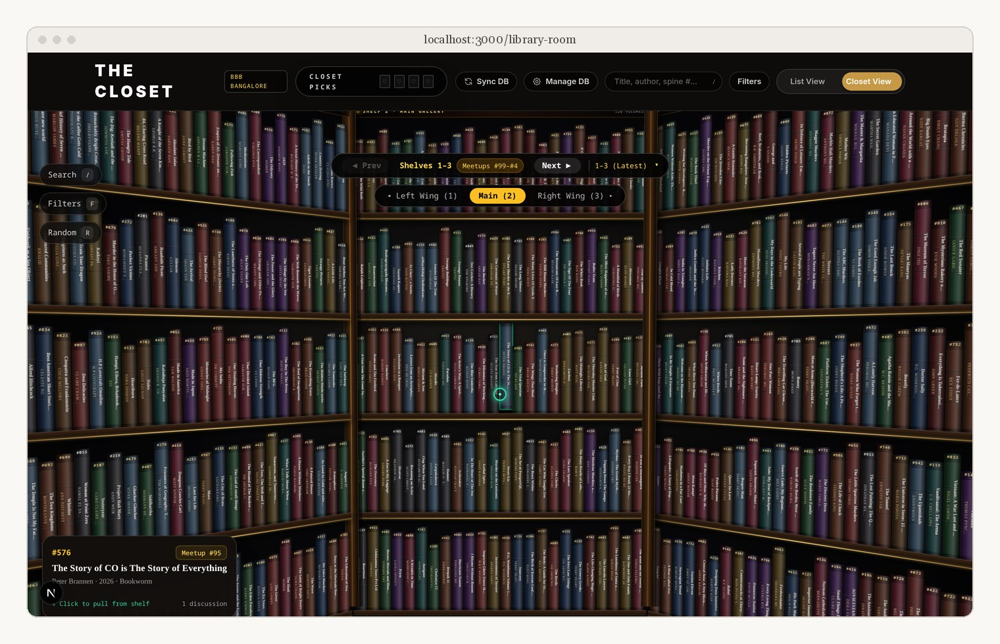
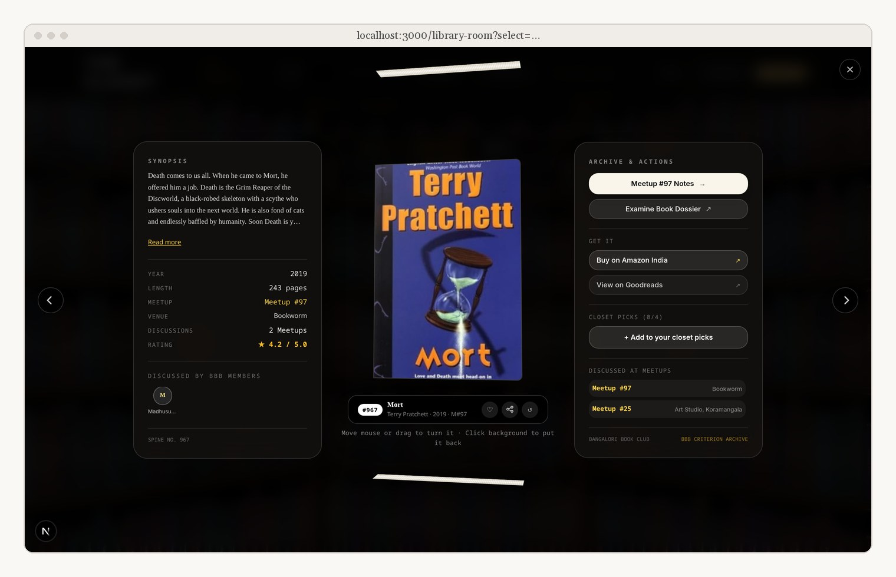
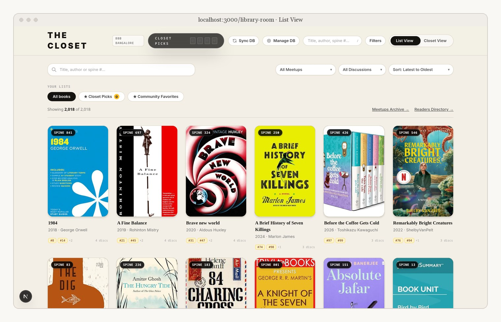
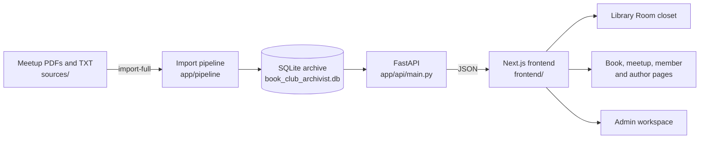

<div align="center">


**Every book the Broke Bibliophiles of Bangalore have brought to the table since 2017, shelved in a closet you can walk into.**

99 meetups · 2000+ books discussed · 100+ members · over the span of a decade

[](https://github.com/MishaelJulian/BBB/actions/workflows/ci.yml)
[](https://github.com/MishaelJulian/BBB/actions/workflows/codeql.yml)
[](pyproject.toml)



</div>

## What it is

BBB Library turns nine years of meetup lists into a browsable archive. The heart of it is the **Library Room**: a Criterion-style closet where every discussed book sits on a shelf. Pull one out and it tells you when it came up, at which meetup, and who brought it.





## Features

- **The closet.** Shelves of real archive books, a hover tooltip on every spine, and a pulled-book card with its meetup history.
- **Book, meetup, member and author pages,** all cross-linked, with a "locate in library" link back to the shelf.
- **Command palette** (`Ctrl+K` / `Cmd+K`) for quick navigation.
- **Import pipeline** that parses the original meetup PDFs and the master text archive into one canonical database, keeping every repeat appearance of a book.
- **Admin workspace** for editing meetups, books and photos, and generating a meetup PDF.
- Search across titles and meetup numbers. Search across authors and discussion notes *(in progress)*.
- Genre filters *(in progress)*.
- OCR for scanned meetup sheets *(in progress)*.

## Quick start

Check your tools first (Docker, Node 20+, uv, and a few others):

```bash
scripts/install_tools.sh            # report what is missing
scripts/install_tools.sh --install  # install it
```

**With Docker** (both services, one command):

```bash
docker compose up -d --build
```

Open http://localhost:3000. The frontend waits until the backend's `/health` check passes.

**Without Docker** (two terminals):

```bash
# backend, port 8000
uv run --no-project --with-requirements requirements.txt python -m uvicorn app.api.main:app --reload --port 8000

# frontend, port 3000
cd frontend && npm install && npm run dev
```

## Examples

Open the closet straight to one book, or to one meetup's shelf:

```text
http://localhost:3000/library-room?select=c544fb5b-e39d-4f82-ac9d-7f00207c9507   Mort, Terry Pratchett
http://localhost:3000/library-room?select=61e36e6b-d761-4cc1-a86f-388319522538   The Giver, Lois Lowry
http://localhost:3000/library-room?meetup=97                                     Meetup #97's shelf
```

Archive pages:

```text
http://localhost:3000/members/Abhiram
http://localhost:3000/authors/Terry%20Pratchett
http://localhost:3000/meetups/97
```

Ask the API directly:

```bash
curl localhost:8000/health
curl "localhost:8000/books?search=pratchett&limit=5"
curl localhost:8000/meetups/97
```

Work with the archive from the command line (inside the backend container, where its packages are installed):

```bash
docker compose exec backend python -m app.cli.main stats     # record counts for every table
docker compose exec backend python -m app.cli.main --help    # all commands
```

`import-full` re-parses `sources/` into the database. Read the database safety rules in `docs/AGENT_RULES.md` §5 before running it on the live archive.

## Architecture



| Layer | Stack |
|---|---|
| Frontend | Next.js 15, React 19, TypeScript, Tailwind CSS, Framer Motion |
| Backend | Python 3.10+, FastAPI, SQLAlchemy 2, Typer CLI |
| Data | SQLite, pdfplumber |
| Tooling | Docker Compose, GitHub Actions (tests, CodeQL, dependency review), Dependabot |

## API reference

| Method | Endpoint | Returns |
|---|---|---|
| `GET` | `/health` | `{"status": "ok", "database": "ok"}`, or 503 when the database is unreachable |
| `GET` | `/stats` | Archive counts, including meetups held and books discussed |
| `GET` | `/books` | Books, with `search`, `author`, `year`, `sort_by`, `sort_order`, `limit`, `offset`, `only_discussed`, `exclude_general`. Paged responses *(in progress)* |
| `GET` | `/books/{id}` | One book with its meetups and members |
| `GET` | `/books/{id}/synopsis` | Synopsis text |
| `GET` | `/meetups`, `/meetups/{id}` | Meetups, and one meetup with its books |
| `GET` | `/members`, `/members/{id}` | Members, and one member's books and meetups (`id` or name) |
| `GET` | `/authors/{id}` | One author's books in the archive |
| `GET` | `/search?q=` | Books by title, meetups by number |

Typed response schemas *(in progress)*. Admin routes live under `/admin/*`; an admin login is on the roadmap.

## Configuration

| Variable | Default | Used by |
|---|---|---|
| `DATABASE_URL` | `sqlite:///./book_club_archivist.db` | Backend |
| `CORS_ORIGINS` | empty (localhost and private LAN only) | Backend, comma-separated extra origins |
| `BACKEND_INTERNAL_URL` | `http://localhost:8000` | Frontend proxy to the API |
| `BACKEND_PORT`, `FRONTEND_PORT` | `8000`, `3000` | `docker-compose.yml` |

Copy `.env.example` to `.env` to change them.

## Engineering notes

- **13 of 17 code-scanning alerts closed** on 7 October 2026, after URL fetching was limited to public addresses (`app/api/main.py`), file paths were confined to `assets/` (`app/core/paths.py`), and CORS was narrowed to localhost and private networks.
- **Docker build context cut from 145.8 MB to 52.3 MB (64%)** after `.dockerignore` switched to patterns that match every folder depth and runtime folders were mounted instead of copied.
- **Target for the next closet:** its first download drops from 2.17 MB to 0.84 MB (61%), because the shelf will load only what the spines show and fetch each book's history when it is opened.

## Development

```bash
uv run --no-project --with-requirements requirements.txt --with-requirements requirements-api.txt --with pytest pytest -q
cd frontend && npm run build
```

`tests/verify/` holds end-to-end checks that run against a live API on port 8000. Frontend tests with React Testing Library *(in progress)*.

## Roadmap

- WebGL closet: a fully 3D Library Room.
- Faster closet loading.
- Search by author and notes; genre filters.
- Typed API responses; frontend tests.
- Security policy, upload limits, admin login.
- OCR for scanned sheets.

## Contributing

Start with [`docs/BBB_PRD_TRD.md`](docs/BBB_PRD_TRD.md), then [`docs/AGENT_RULES.md`](docs/AGENT_RULES.md). Both apply to people and AI agents alike. To brief an AI model in one step, give it [`docs/MASTER_PROMPT.md`](docs/MASTER_PROMPT.md). Commits follow `type: summary` (`feat`, `fix`, `docs`, `chore`, `build`).

## License

[MIT](LICENSE). Built for the Broke Bibliophiles of Bangalore.
