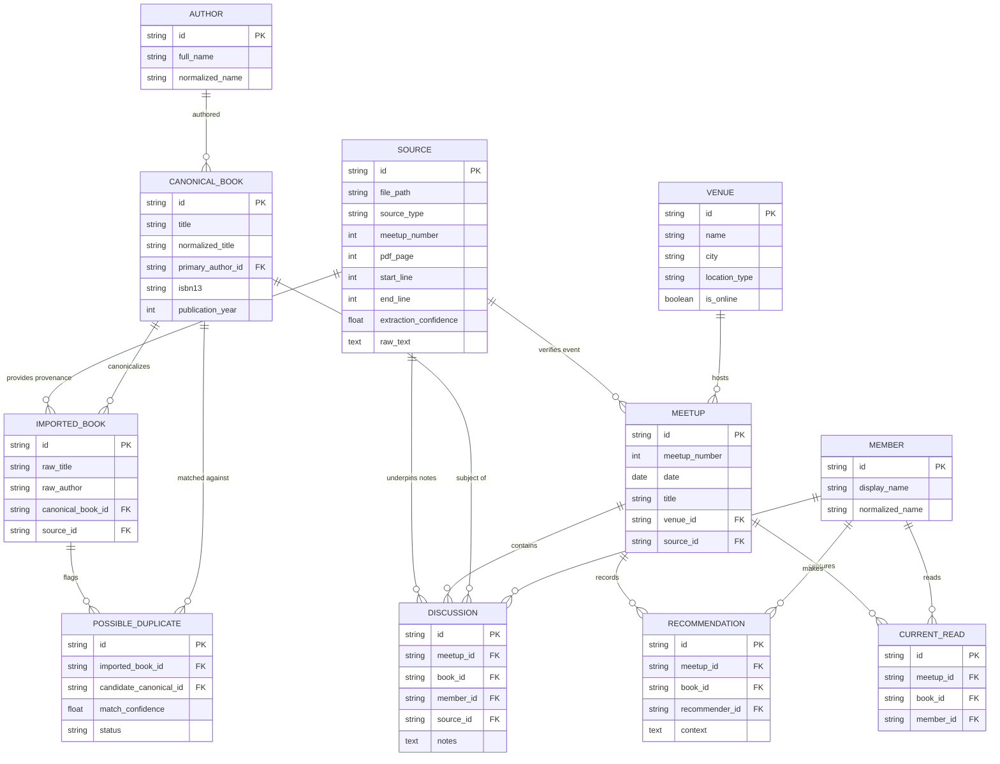

# Canonical Archive Specification — BBB Library

**Project**: Broke Bibliophiles Bangalore (BBB) Digital Archive  
**Document**: Sprint 1A — Canonical Archive Architectural Specification  
**Status**: Specification Phase (Approved Pre-Implementation Document)  
**Target Audience**: Systems Architects, Data Engineers, Software Engineers  

---

## 1. Executive Summary & Core Archival Principles

The **BBB Library Archive** is engineered as a digital humanities platform. Unlike transient commercial web applications, this system prioritizes **uncompromising provenance tracking**, **immutable historical records**, and **explicit entity resolution workflows**.

### The Three-Layer Immutable Data Principles

```text
  [ Layer 1: Raw Imported Record ]
                 │
                 ▼  (Extraction & Normalization)
[ Layer 2: Normalized Candidate Record ]
                 │
                 ▼  (Review Queue & Entity Resolution)
   [ Layer 3: Canonical Archive Record ]
```

1. **Layer 1 — Raw Imported Record (Immutable Source Provenance)**:
   Raw text, PDF page numbers, paragraph indices, exact original line strings, and raw metadata are preserved *forever* without mutation. No data cleaning or editing ever occurs at this layer.
2. **Layer 2 — Normalized Candidate Record (Staging & Staged Entities)**:
   Extracted facts (titles, authors, dates) are parsed, sanitized, and matched against existing database entries. Confidence scores and candidate merge links (`PossibleDuplicate`) are calculated.
3. **Layer 3 — Canonical Archive Record (Verified Single Source of Truth)**:
   The curated entity representations (`CanonicalBook`, `Author`, `Meetup`, `Venue`, `Discussion`) consumed by public APIs, search indexes, and the 3D virtual closet.

---

## 2. Comprehensive Entity Specifications

### A. Book (`Book` & `CanonicalBook`)

#### 1. What is a Book?
A **Book** represents a distinct literary work discussed, mentioned, or recommended within Broke Bibliophiles Bangalore. To support real-world archival noise (spelling variations, subtitle omissions), the system separates raw **Imported Book** records from resolved **Canonical Book** records.

#### 2. Fields Specification
* **Required Fields**:
  - `id` (UUIDv4 String, Primary Key)
  - `title` (String, Non-null, Original extracted title string)
  - `normalized_title` (String, Non-null, Lowercase alphanumeric stripped string used for candidate matching)
  - `created_at` (UTC Datetime)
  - `updated_at` (UTC Datetime)
* **Optional Fields**:
  - `subtitle` (String)
  - `sort_title` (String, e.g., "Room of One's Own, A")
  - `isbn10` / `isbn13` (String, Standardized ISBN)
  - `asin` (String, Amazon Standard Identification Number)
  - `language` (String, Default: "en")
  - `publication_year` (Integer)
  - `page_count` (Integer)
  - `cover_url` / `thumbnail_url` (String, Remote or local asset path)
  - `description` (Text)
  - `goodreads_id` / `openlibrary_id` / `google_books_id` (String)
  - `rating` (Float, 0.0 to 5.0 scale)
* **Relationships**:
  - `author_id` $\rightarrow$ Foreign Key to `Author` (Many-to-One)
  - `publisher_id` $\rightarrow$ Foreign Key to `Publisher` (Many-to-One)
  - `series_id` $\rightarrow$ Foreign Key to `Series` (Many-to-One)
  - `discussions` $\rightarrow$ One-to-Many relationship with `Discussion`
  - `recommendations` $\rightarrow$ One-to-Many relationship with `Recommendation`
  - `sources` $\rightarrow$ Many-to-Many linkage via `Source`

#### 3. Validation Rules
- Title length must be $\ge 1$ non-whitespace character.
- If `isbn13` is present, it must pass standard ISBN-13 checksum validation.
- If `publication_year` is present, it must be between 1000 and 2100.

#### 4. Uniqueness & Deduplication Rules
- Raw imported books are **NEVER** forced into unique constraints at ingestion.
- Uniqueness is enforced at Layer 3 (`CanonicalBook`). A canonical book is unique by the tuple `(normalized_title, primary_author_id)`.

#### 5. Merge Rules & Archive Review Workflow
```text
  [ New Imported Book ]
            │
            ▼
[ Fuzzy Match Check (Levenshtein Distance ≥ 85%) ]
     ├── Match Found? ──► Create [ PossibleDuplicate ] ──► Enter [ Review Queue ] ──► [ Manual / Rule Approval ] ──► Link to [ CanonicalBook ]
     └── No Match ────► Auto-Promote / Staging ─────────────────────────────────────────────────────────────► Create [ CanonicalBook ]
```

---

### B. Meetup (`Meetup`)

#### 1. What is a Meetup?
A **Meetup** represents a single historical gathering of Broke Bibliophiles Bangalore on a specific date at a specific venue.

#### 2. Fields Specification
* **Required Fields**:
  - `id` (UUIDv4 String)
  - `meetup_number` (Integer, Non-null, Unique identifier for BBB meetups, e.g. #20)
  - `created_at`, `updated_at` (UTC Datetime)
* **Optional Fields**:
  - `date` (Date, ISO 8601 YYYY-MM-DD; NULL if date is unrecorded)
  - `title` (String, e.g. "BBB Meetup #20 — Sci-Fi & Fantasy Special")
  - `venue_id` (UUID String, Foreign Key to `Venue`)
  - `description` (Text, Summary of the meetup atmosphere, food ordered, special events)
  - `attendance_count` (Integer, Number of attendees if recorded in source notes)
  - `format` (Enum: `IN_PERSON`, `ONLINE`, `HYBRID`)
  - `source_id` (UUID String, Foreign Key to primary provenance record `Source`)
* **Relationships**:
  - `venue` $\rightarrow$ Many-to-One relationship with `Venue`
  - `discussions` $\rightarrow$ One-to-Many relationship with `Discussion`
  - `current_reads` $\rightarrow$ One-to-Many relationship with `CurrentRead`
  - `recommendations` $\rightarrow$ One-to-Many relationship with `Recommendation`
  - `resources` $\rightarrow$ One-to-Many relationship with `Resource`

---

### C. Discussion (`Discussion`)

#### 1. What Qualifies as a Discussion?
A **Discussion** is an explicit interaction recorded during a meetup where one or more members discussed, analyzed, or presented a specific book (or theme).

#### 2. Core Architectural Questions Answered
* **Can a discussion exist without a Book?**  
  **Yes**. In rare cases (e.g. general thematic debates on "Translators vs. Authors" in Meetup #34), a discussion record can focus on a topic/theme without a linked `book_id` (in which case `book_id` is NULL and `topic` is non-null).
* **Can multiple books belong to one discussion?**  
  Primary discussions map 1-to-1 with a primary book (`book_id`). Comparative discussions link auxiliary books via `book_mentions` or `book_relations`.
* **Can one member participate in many discussions?**  
  **Yes**. A member can present multiple books in a single meetup, or participate across 50 meetups over years.

#### 3. Fields Specification
* **Required Fields**:
  - `id` (UUIDv4 String)
  - `meetup_id` (UUID String, Foreign Key to `Meetup`)
  - `created_at`, `updated_at` (UTC Datetime)
* **Optional Fields**:
  - `book_id` (UUID String, Foreign Key to `CanonicalBook`)
  - `member_id` / `presenter_id` (UUID String, Foreign Key to `Member`)
  - `notes` (Text, Detailed discussion notes extracted from raw source)
  - `rating` (Float, 0.0 to 5.0)
  - `sentiment` (String, e.g. "Highly praised", "Mixed reactions", "Debated")
  - `reading_status` (Enum: `COMPLETED`, `CURRENTLY_READING`, `ABANDONED`)
  - `confidence_score` (Float, 0.0 to 1.0 extraction confidence)
  - `source_id` (UUID String, Foreign Key to provenance `Source`)

---

### D. Recommendation, Current Read, & Mention Taxonomy

To prevent data ambiguity, interactions are strictly partitioned into 4 distinct categories:

```text
                          ┌───────────────────────────┐
                          │   BBB Interaction Types   │
                          └─────────────┬─────────────┘
                                        │
    ┌──────────────────┬────────────────┴────────────────┬──────────────────┐
    ▼                  ▼                                 ▼                  ▼
[ Discussion ]   [ Recommendation ]               [ Current Read ]     [ Mention ]
Detailed review  Explicitly suggested             Member is actively   Casual reference
or presentation  by Member A to Member B          reading book         during chatter
```

1. **`Discussion`**: Dedicated review, presentation, or debate around a book during a meetup.
2. **`Recommendation`**: Explicit suggestion made by Member A (or general community) to read Book X. Stores `recommender_member_id`, `target_book_id`, `context`, and `meetup_id`.
3. **`Current Read`**: Active reading status declared by a member during meetup introductions ("I'm currently reading X"). Stores `member_id`, `book_id`, `progress_notes`, `meetup_id`.
4. **`Mention`**: Casual or contextual reference to a book during a broader conversation. Stores `discussion_id`, `mentioned_book_id`, `context_snippet`.

---

### E. Provenance & Source (`Source`)

#### How Provenance is Preserved Forever
Every single extracted entity, fact, quote, or relationship in the database carries an immutable link (`source_id`) to a record in `sources`.

#### Fields Specification (`Source`)
* `id` (UUIDv4 String)
* `file_path` (String, Relative path to source document, e.g. `BBB Meetup-9.txt` or `70 - BBB Meetup 70 - Mar 2024.pdf`)
* `source_type` (Enum: `TXT_ARCHIVE`, `PDF_DOCUMENT`, `NOTION_EXPORT`, `BLOG_POST`)
* `meetup_number` (Integer, Extracted meetup number)
* `pdf_page` (Integer, Nullable)
* `paragraph_index` (Integer, Nullable)
* `start_line` / `end_line` (Integer, Nullable, Line boundaries in text files)
* `extraction_confidence` (Float, 0.0 to 1.0)
* `raw_text` (Text, Exact unedited original substring)
* `importer_name` (String, Name of parser script version)
* `created_at` (UTC Datetime)

---

## 3. Mermaid Entity Relationship (ER) Diagram



---

## 4. System Data Flow Architecture

```text
+-------------------------------------------------------------------------+
|                         LAYER 1: RAW INGESTION                          |
|                                                                         |
|  [ BBB Meetup-9.txt ]   [ 25 PDF Files (#70-#98) ]   [ Legacy SQLite ] |
+--------------------------------────┬------------------------------------+
                                     │
                                     ▼
+-------------------------------------------------------------------------+
|                         LAYER 2: PARSER ENGINE                          |
|                                                                         |
|  - Text Block Parser (Regex + Line Boundaries)                          |
|  - PDF Table & Text Extractor (PyPDF / pdfplumber)                      |
|  - Provenance Attacher (Attaches file_path, line_nos, raw_text)         |
+--------------------------------────┬------------------------------------+
                                     │
                                     ▼
+-------------------------------------------------------------------------+
|               LAYER 3: INTERMEDIATE STAGING & VALIDATION                |
|                                                                         |
|  - Intermediate Schemas (Pydantic IntermediateRecord)                  |
|  - Validation Engine (Field format checks, date normalization)         |
|  - Audit Log Creation (import_jobs, validation_errors)                  |
+--------------------------------────┬------------------------------------+
                                     │
                                     ▼
+-------------------------------------------------------------------------+
|            LAYER 4: ENTITY RESOLUTION & REVIEW QUEUE                    |
|                                                                         |
|  - Levenshtein Fuzzy Matcher (Calculates similarity index)               |
|  - PossibleDuplicate Flagging (Confidence ≥ 85% → Review Queue)         |
|  - Alias Dictionary Lookup (Aliases table)                             |
+--------------------------------────┬------------------------------------+
                                     │
                                     ▼
+-------------------------------------------------------------------------+
|                  LAYER 5: CANONICAL POSTGRESQL ARCHIVE                  |
|                                                                         |
|  - CanonicalBook, Author, Meetup, Venue, Discussion, Source             |
|  - PostgreSQL Full-Text Search Vector Indexes                           |
+--------------------------------────┬------------------------------------+
                                     │
                                     ▼
+-------------------------------------------------------------------------+
|                     LAYER 6: FASTAPI REST & GRAPHQL API                 |
|                                                                         |
|  - GET /api/v1/books/{id} (Returns book + provenance + discussions)     |
|  - GET /api/v1/meetups/{id} (Returns meetup + venue + discussions)       |
|  - GET /api/v1/timeline (Returns chronological archive stream)           |
+--------------------------------────┬------------------------------------+
                                     │
                                     ▼
+-------------------------------------------------------------------------+
|                 LAYER 7: FRONTEND & 3D VIRTUAL CLOSET                   |
|                                                                         |
|  - Next.js 14 App Router UI                                             |
|  - Three.js / React Three Fiber Criterion Closet Shelf                  |
+-------------------------------------------------------------------------+
```

---

## 5. Specification Review Summary

This specification establishes an immutable, museum-grade archival foundation for Broke Bibliophiles Bangalore. 

* **Sprint 1A**: Canonical Archive Specification (Complete ✅)
* **Sprint 1B**: Implementation of SQLAlchemy 2.0 AsyncIO models in `bbb-library/backend/app/models/` matching this exact specification.
* **Sprint 1C**: Full ingestion of `BBB Meetup-9.txt` & 25 PDFs into PostgreSQL, culminating in `archive_summary.md`.
