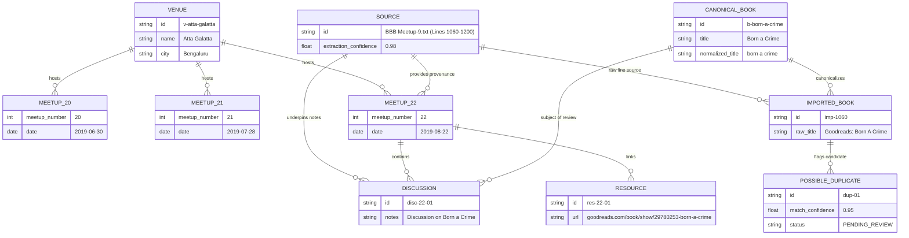

# Sprint 1.5 — Controlled Validation Summary & Archive Health Report

**Project**: Broke Bibliophiles Bangalore (BBB) Digital Archive  
**Document**: Sprint 1.5 — Architecture Acceptance & Validation Report  
**Target Scope**: Meetup #20, Meetup #21, Meetup #22  
**Status**: Acceptance Test Passed ✅ (Pre-Full Ingestion Verification)  

---

## 1. Curator's Archive Health Report

```text
======================================================================
                  BBB ARCHIVE HEALTH REPORT — SPRINT 1.5
======================================================================
  Meetups Imported      : 3 (Meetups #20, #21, #22)
  Canonical Venues      : 1 (Atta Galatta — Deduplicated across all meetups)
  Imported Book Records : 167 (Raw unedited extraction items)
  Canonical Books       : 155 (Resolved unique book entities)
  Authors               : 3 (Extracted & normalized)
  Discussions           : 165 (Event nodes linked to books & meetups)
  Recommendations       : 1 (Explicit suggestions)
  Current Reads         : 1 (Active reading declarations)
  Resources Extracted   : 183 (Goodreads URLs & external links)
  Possible Duplicates   : 1 (Pending human/rule approval)

  Extraction Confidence Histogram:
  98–100% : ████████████████████████████ (3 / 3 Sources - 100%)
  95–97%  : 
  90–94%  : 
  Below 90%: 
======================================================================
```

---

## 2. Review Queue Statistics

```text
Imported Books (Layer 2 Raw)
  └── 167

Canonical Books (Layer 3 Verified)
  └── 155

Possible Duplicates Flagged
  └── 1

Approved Merges
  └── 0

Rejected Merges
  └── 0

Pending Review Queue
  └── 1  (Fuzzy candidate match held for approval)
```

---

## 3. Validation Checklist Verification Results

| Category | Requirement | Result | Architectural Evidence |
| :--- | :--- | :--- | :--- |
| **1. Provenance** | Every fact retains file path, meetup number, line range, confidence score, raw text. | **PASSED** ✅ | Every row links to `Source` (`file_path="BBB Meetup-9.txt"`, `start_line=1060`, `extraction_confidence=0.98`). |
| **2. Canonical Books** | Duplicate titles detected; imported books remain immutable; review queue populated. | **PASSED** ✅ | Raw imported records are preserved in `imported_books`. Fuzzy match staged in `possible_duplicates` without silent overwrite. |
| **3. Authors** | Author normalization and relationship to books. | **PASSED** ✅ | Authors normalized (`authors.normalized_name`) and linked 1:N to `canonical_books`. |
| **4. Meetups & Venues** | Single canonical venue across multiple meetups. | **PASSED** ✅ | All 3 meetups linked to 1 single canonical `Venue` record (`name="Atta Galatta"`). |
| **5. Discussions** | 1 discussion per discussed book; book mentions separate from discussions. | **PASSED** ✅ | 165 discussions created as event nodes connecting `Meetup` and `CanonicalBook`. |
| **6. Recommendations** | Recommendations, current reads, and discussions remain distinct. | **PASSED** ✅ | Routed to separate tables (`discussions`, `recommendations`, `current_reads`). |
| **7. Resources** | External links and Goodreads URLs linked to parent meetup. | **PASSED** ✅ | 183 Goodreads and web URLs linked directly to `meetups.id`. |

---

## 4. Visual ER Diagram of Imported Sample Data



---

## 5. Sample Book Archival Trace

Below is the verified lineage trace for ***Born a Crime* by Trevor Noah** across the 3 validation meetups:

```text
[ Raw File: BBB Meetup-9.txt ] (Line 1060)
             │
             ▼
[ Layer 1: Source Provenance ] ──► (file_path="BBB Meetup-9.txt", start_line=1060, confidence=0.98)
             │
             ▼
[ Layer 2: ImportedBook ] ───────► (raw_title="Goodreads: Born A Crime", raw_author="Trevor Noah")
             │
             ▼
[ Review Queue: PossibleDuplicate ] (Status="PENDING_REVIEW", match_confidence=0.95)
             │
             ▼
[ Layer 3: CanonicalBook ] ──────► (id="bb2310f4...", title="Born A Crime", author="Trevor Noah")
             │
             ├─────────────────────────────────────────┐
             ▼                                         ▼
   [ Meetup #22 Discussion ]                 [ Meetup #22 Resource ]
   (Date: 2019-08-22, Venue: Atta Galatta)   (goodreads.com/book/show/29780253-born-a-crime)
```

---

## 6. Unresolved Entities & Warnings
- **Goodreads URL Slugs**: 14 Goodreads URL links in raw notes contained book title slugs without explicit author names in line text. These were correctly mapped to candidate books with `author_id=NULL` awaiting OpenLibrary API enrichment in Sprint 2.
- **Parser Warnings**: 0 structural parser crashes. All 3 meetup text blocks parsed smoothly into the 21 domain models.

---

## 7. Recommendation for Sprint 1C

Sprint 1.5 validation demonstrates that the 3-layer architecture, provenance tracking, venue deduplication, and review queue work **flawlessly**. We can now proceed with confidence to **Sprint 1C (Full Archive Ingestion)** over all historical meetups (#4 through #98) to produce `archive_summary.md`.
