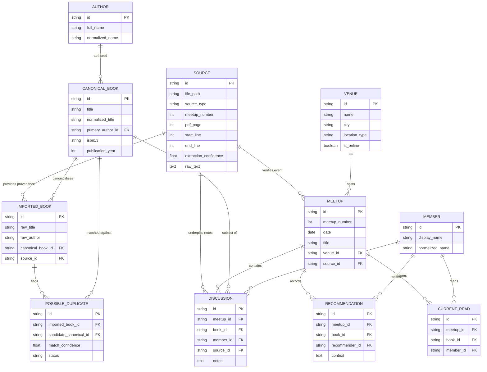

# Imperative Decisions: BBB Library

> Renamed from `canonical_archive_specification.md` on 2026-10-09. §2 (entity specifications) is required. Founder review notes are marked **Review 2026-10-09**.

**Project**: Broke Bibliophiles Bangalore (BBB) Digital Archive  
**Document**: Sprint 1A — Canonical Archive Architectural Specification  
**Status**: Specification Phase (Approved Pre-Implementation Document)  
**Target Audience**: Systems Architects, Data Engineers, Software Engineers  

---

## 1. Executive Summary & Core Archival Principles

The **BBB Library Archive** is engineered as a digital humanities platform. Unlike transient commercial web applications, this system prioritizes **uncompromising provenance tracking**, **immutable historical records**, and **explicit entity resolution workflows**.

The three-layer data model (raw, normalized candidate, canonical) is defined once in `domain_model.md` §1.

---

## 2. Comprehensive Entity Specifications

> **Review 2026-10-09:** this section is required.

### A. Book (`Book` & `CanonicalBook`)

#### 1. What is a Book?
A **Book** represents a distinct literary work discussed, mentioned, or recommended within Broke Bibliophiles Bangalore. To support real-world archival noise (spelling variations, subtitle omissions), the system separates raw **Imported Book** records from resolved **Canonical Book** records.

#### 2. Fields Specification
* **Required Fields**:
  - `id` (UUIDv4 String, Primary Key)
  - `title` (String, Non-null, Original extracted title string)
  - `normalized_title` (String, Non-null, Lowercase alphanumeric stripped string used for candidate matching)
  - `created_at` (UTC Datetime)
  - `updated_at` (UTC Datetime)
* **Optional Fields**:
  - `subtitle` (String)
  - `sort_title` (String, e.g., "Room of One's Own, A")
  - `isbn10` / `isbn13` (String, Standardized ISBN)
  - `asin` (String, Amazon Standard Identification Number)
  - `language` (String, Default: "en")
  - `publication_year` (Integer)
  - `page_count` (Integer)
  - `cover_url` / `thumbnail_url` (String, Remote or local asset path)
  - `description` (Text)
  - `goodreads_id` / `openlibrary_id` / `google_books_id` (String)
  - `rating` (Float, 0.0 to 5.0 scale)
* **Relationships**:
  - `author_id` $\rightarrow$ Foreign Key to `Author` (Many-to-One)
  - `publisher_id` $\rightarrow$ Foreign Key to `Publisher` (Many-to-One)
  - `series_id` $\rightarrow$ Foreign Key to `Series` (Many-to-One)
  - `discussions` $\rightarrow$ One-to-Many relationship with `Discussion`
  - `recommendations` $\rightarrow$ One-to-Many relationship with `Recommendation`
  - `sources` $\rightarrow$ Many-to-Many linkage via `Source`

#### 3. Validation Rules
- Title length must be $\ge 1$ non-whitespace character.
- If `isbn13` is present, it must pass standard ISBN-13 checksum validation.
- If `publication_year` is present, it must be between 1000 and 2100.

#### 4. Uniqueness & Deduplication Rules
- Raw imported books are **NEVER** forced into unique constraints at ingestion.
- Uniqueness is enforced at Layer 3 (`CanonicalBook`). A canonical book is unique by the tuple `(normalized_title, primary_author_id)`.

> **Review 2026-10-09:** §3 and §4 are sound in logic and do not yet cover odd real-world cases. Book attributes should come from ISBN rules and legal book-naming practice. Research deferred: `docs/plans/backlog.md` R1 (affects DB, API and OCR).

#### 5. Merge Rules & Archive Review Workflow

> **Review 2026-10-09 (contention):** fuzzy matching every new book against canonical books slows down as the archive grows. Needs a faster algorithm: backlog R2.

> **Threshold decided 2026-10-09 (Q6):** the "≥ 85%" in the diagram below is replaced by two bands: 0.90 and above "likely", 0.75 to 0.90 "possible"; nothing merges automatically (§6).
```text
  [ New Imported Book ]
            │
            ▼
[ Fuzzy Match Check (Levenshtein Distance ≥ 85%) ]
     ├── Match Found? ──► Create [ PossibleDuplicate ] ──► Enter [ Review Queue ] ──► [ Manual / Rule Approval ] ──► Link to [ CanonicalBook ]
     └── No Match ────► Auto-Promote / Staging ─────────────────────────────────────────────────────────────► Create [ CanonicalBook ]
```

---

### B. Meetup (`Meetup`)

> **Review 2026-10-09:** agreed.

#### 1. What is a Meetup?
A **Meetup** represents a single historical gathering of Broke Bibliophiles Bangalore on a specific date at a specific venue.

#### 2. Fields Specification
* **Required Fields**:
  - `id` (UUIDv4 String)
  - `meetup_number` (Integer, Non-null, Unique identifier for BBB meetups, e.g. #20)
  - `created_at`, `updated_at` (UTC Datetime)
* **Optional Fields**:
  - `date` (Date, ISO 8601 YYYY-MM-DD; NULL if date is unrecorded)
  - `title` (String, e.g. "BBB Meetup #20 — Sci-Fi & Fantasy Special")
  - `venue_id` (UUID String, Foreign Key to `Venue`)
  - `description` (Text, Summary of the meetup atmosphere, food ordered, special events)
  - `attendance_count` (Integer, Number of attendees if recorded in source notes)
  - `format` (Enum: `IN_PERSON`, `ONLINE`, `HYBRID`)
  - `source_id` (UUID String, Foreign Key to primary provenance record `Source`)
* **Relationships**:
  - `venue` $\rightarrow$ Many-to-One relationship with `Venue`
  - `discussions` $\rightarrow$ One-to-Many relationship with `Discussion`
  - `current_reads` $\rightarrow$ One-to-Many relationship with `CurrentRead`
  - `recommendations` $\rightarrow$ One-to-Many relationship with `Recommendation`
  - `resources` $\rightarrow$ One-to-Many relationship with `Resource`

---

### C. Discussion (`Discussion`)

> **Review 2026-10-09:** accepted.

#### 1. What Qualifies as a Discussion?
A **Discussion** is an explicit interaction recorded during a meetup where one or more members discussed, analyzed, or presented a specific book (or theme).

#### 2. Core Architectural Questions Answered
* **Can a discussion exist without a Book?**  
  **Yes**. In rare cases (e.g. general thematic debates on "Translators vs. Authors" in Meetup #34), a discussion record can focus on a topic/theme without a linked `book_id` (in which case `book_id` is NULL and `topic` is non-null).
* **Can multiple books belong to one discussion?**  
  Primary discussions map 1-to-1 with a primary book (`book_id`). Comparative discussions link auxiliary books via `book_mentions` or `book_relations`.
* **Can one member participate in many discussions?**  
  **Yes**. A member can present multiple books in a single meetup, or participate across 50 meetups over years.

#### 3. Fields Specification
* **Required Fields**:
  - `id` (UUIDv4 String)
  - `meetup_id` (UUID String, Foreign Key to `Meetup`)
  - `created_at`, `updated_at` (UTC Datetime)
* **Optional Fields**:
  - `book_id` (UUID String, Foreign Key to `CanonicalBook`)
  - `member_id` / `presenter_id` (UUID String, Foreign Key to `Member`)
  - `notes` (Text, Detailed discussion notes extracted from raw source)
  - `rating` (Float, 0.0 to 5.0)
  - `sentiment` (String, e.g. "Highly praised", "Mixed reactions", "Debated")
  - `reading_status` (Enum: `COMPLETED`, `CURRENTLY_READING`, `ABANDONED`)
  - `confidence_score` (Float, 0.0 to 1.0 extraction confidence)
  - `source_id` (UUID String, Foreign Key to provenance `Source`)

---

### D. Recommendation, Current Read, & Mention Taxonomy

> **Review 2026-10-09 (contention):** this is the base of a long-lasting recommendation feature and must stay fast as books increase. Backlog R3.

To prevent data ambiguity, interactions are strictly partitioned into 4 distinct categories:

```text
                          ┌───────────────────────────┐
                          │   BBB Interaction Types   │
                          └─────────────┬─────────────┘
                                        │
    ┌──────────────────┬────────────────┴────────────────┬──────────────────┐
    ▼                  ▼                                 ▼                  ▼
[ Discussion ]   [ Recommendation ]               [ Current Read ]     [ Mention ]
Detailed review  Explicitly suggested             Member is actively   Casual reference
or presentation  by Member A to Member B          reading book         during chatter
```

1. **`Discussion`**: Dedicated review, presentation, or debate around a book during a meetup.
2. **`Recommendation`**: Explicit suggestion made by Member A (or general community) to read Book X. Stores `recommender_member_id`, `target_book_id`, `context`, and `meetup_id`.
3. **`Current Read`**: Active reading status declared by a member during meetup introductions ("I'm currently reading X"). Stores `member_id`, `book_id`, `progress_notes`, `meetup_id`.
4. **`Mention`**: Casual or contextual reference to a book during a broader conversation. Stores `discussion_id`, `mentioned_book_id`, `context_snippet`.

---

### E. Provenance & Source (`Source`)

> **Review 2026-10-09:** agreed.

#### How Provenance is Preserved Forever
Every single extracted entity, fact, quote, or relationship in the database carries an immutable link (`source_id`) to a record in `sources`.

#### Fields Specification (`Source`)
* `id` (UUIDv4 String)
* `file_path` (String, Relative path to source document, e.g. `BBB Meetup-9.txt` or `70 - BBB Meetup 70 - Mar 2024.pdf`)
* `source_type` (Enum: `TXT_ARCHIVE`, `PDF_DOCUMENT`, `NOTION_EXPORT`, `BLOG_POST`)
* `meetup_number` (Integer, Extracted meetup number)
* `pdf_page` (Integer, Nullable)
* `paragraph_index` (Integer, Nullable)
* `start_line` / `end_line` (Integer, Nullable, Line boundaries in text files)
* `extraction_confidence` (Float, 0.0 to 1.0)
* `raw_text` (Text, Exact unedited original substring)
* `importer_name` (String, Name of parser script version)
* `created_at` (UTC Datetime)

---

## 3. Mermaid Entity Relationship (ER) Diagram



---

## 4. System Data Flow Architecture

> **Status: roadmap (review 2026-10-09).** Too advanced for now, same as `universal_app_flow.md`. Current flow: `docs/BBB_PRD_TRD.md` §9.

```text
+-------------------------------------------------------------------------+
|                         LAYER 1: RAW INGESTION                          |
|                                                                         |
|  [ BBB Meetup-9.txt ]   [ 25 PDF Files (#70-#98) ]   [ Legacy SQLite ] |
+--------------------------------────┬------------------------------------+
                                     │
                                     ▼
+-------------------------------------------------------------------------+
|                         LAYER 2: PARSER ENGINE                          |
|                                                                         |
|  - Text Block Parser (Regex + Line Boundaries)                          |
|  - PDF Table & Text Extractor (PyPDF / pdfplumber)                      |
|  - Provenance Attacher (Attaches file_path, line_nos, raw_text)         |
+--------------------------------────┬------------------------------------+
                                     │
                                     ▼
+-------------------------------------------------------------------------+
|               LAYER 3: INTERMEDIATE STAGING & VALIDATION                |
|                                                                         |
|  - Intermediate Schemas (Pydantic IntermediateRecord)                  |
|  - Validation Engine (Field format checks, date normalization)         |
|  - Audit Log Creation (import_jobs, validation_errors)                  |
+--------------------------------────┬------------------------------------+
                                     │
                                     ▼
+-------------------------------------------------------------------------+
|            LAYER 4: ENTITY RESOLUTION & REVIEW QUEUE                    |
|                                                                         |
|  - Levenshtein Fuzzy Matcher (Calculates similarity index)               |
|  - PossibleDuplicate Flagging (Confidence ≥ 85% → Review Queue)         |
|  - Alias Dictionary Lookup (Aliases table)                             |
+--------------------------------────┬------------------------------------+
                                     │
                                     ▼
+-------------------------------------------------------------------------+
|                  LAYER 5: CANONICAL POSTGRESQL ARCHIVE                  |
|                                                                         |
|  - CanonicalBook, Author, Meetup, Venue, Discussion, Source             |
|  - PostgreSQL Full-Text Search Vector Indexes                           |
+--------------------------------────┬------------------------------------+
                                     │
                                     ▼
+-------------------------------------------------------------------------+
|                     LAYER 6: FASTAPI REST & GRAPHQL API                 |
|                                                                         |
|  - GET /api/v1/books/{id} (Returns book + provenance + discussions)     |
|  - GET /api/v1/meetups/{id} (Returns meetup + venue + discussions)       |
|  - GET /api/v1/timeline (Returns chronological archive stream)           |
+--------------------------------────┬------------------------------------+
                                     │
                                     ▼
+-------------------------------------------------------------------------+
|                 LAYER 7: FRONTEND & 3D VIRTUAL CLOSET                   |
|                                                                         |
|  - Next.js 14 App Router UI                                             |
|  - Three.js / React Three Fiber Criterion Closet Shelf                  |
+-------------------------------------------------------------------------+
```

> **Note (2026-10-08):** Three.js / React Three Fiber here is a plan from an earlier sprint. The live closet uses CSS 3D. WebGL is a future option for the closet only, after the admission rule in `docs/BBB_PRD_TRD.md` §7.1 (see §18.1).

---

## 5. Specification Review Summary

> **Historical (noted 2026-10-09):** the sprint plan below targeted PostgreSQL and a `bbb-library/backend` path that does not exist. The live stack and the current decisions are in §6 and `bbb-library-architecture.md`.

This specification establishes an immutable, museum-grade archival foundation for Broke Bibliophiles Bangalore. 

* **Sprint 1A**: Canonical Archive Specification (Complete ✅)
* **Sprint 1B**: Implementation of SQLAlchemy 2.0 AsyncIO models in `bbb-library/backend/app/models/` matching this exact specification.
* **Sprint 1C**: Full ingestion of `BBB Meetup-9.txt` & 25 PDFs into PostgreSQL, culminating in `archive_summary.md`.

---

## 6. Decision log

Dated architecture decisions, ADR style. Each entry gives the decision, the options the founders rejected, and the sources. A later decision replaces an earlier one by naming it; entries are never edited in place. Analysis behind these decisions: `docs/architecture/flow_comparison.md`, `docs/health/*`. Founder answers to open questions: `FOUNDER_QUESTIONS.md`.

### 6.1 Decisions of 2026-10-09 (architecture consult)

**Hosting, runtime and security**

| ID | Decision | Rejected | Sources |
|---|---|---|---|
| D1 | Split host: Next.js frontend on Vercel (Hobby, non-commercial), FastAPI + SQLite on a VPS | All on Vercel with a hosted DB; one VPS without Vercel; read-only static demo | vercel.com/docs/plans/hobby; vercel.com/docs/functions/limitations (no persistent disk, 4.5 MB body, 300 s max) |
| D6 | VPS: DigitalOcean BLR1, 1 GB droplet, $6.00/mo + 18 % GST = $7.08/mo; own backups | Hetzner Singapore (274 ms measured, Airtel, Bengaluru); Hetzner EU; Oracle Always Free (limits cut 2026-06-15, idle reclaim) | digitalocean.com/pricing/droplets; docs.digitalocean.com/platform/billing/taxes/ind; latency measured 2026-10-09 (DO BLR1 38 ms, Vercel edge 34 ms) |
| D5, D21 | Auth: Better Auth (MIT) as a sidecar on the droplet; personal data in a separate `auth.db`; FastAPI verifies Ed25519 JWTs via JWKS; passkeys; email links through PostHog on a club mail subdomain; public reads anonymous | Clerk (closed service; MFA and passkeys paid); Auth.js (maintenance mode since 2025-09-22); Python-side auth | better-auth.com/docs/plugins/jwt; better-auth.com/blog/authjs-joins-better-auth; clerk.com/pricing; GitHub licence fields |
| D7 | Secrets: SOPS + age, one key per admin | Infisical Cloud free (no audit log, versioning or rotation); Infisical self-hosted (Postgres 8 GB + Redis); env vars only | infisical.com/pricing; infisical.com/docs/self-hosting/configuration/requirements |
| D8 | The archive DB stays public by intent; the privacy policy says so and offers removal on request; auth data stays private | Untrack; scrub history | DPDP Rules 2025 (notified 2025-11-13) |
| D12 | API split by audience in the same change as auth: public router (GET, cacheable), admin/presenter router (auth on every route), health | One file with per-route auth; full split by domain | `app/api/main.py` (2,226 lines) |
| D26 | Swagger: public routes public; admin and presenter routes shown to admins only | Admins only; fully public | FastAPI `/docs`, `/openapi.json` |
| D28 | Bot protection: ALTCHA (MIT), verified by FastAPI | Friendly Captcha (service paid; free plan non-commercial, 1,000 requests a month) | github.com/altcha-org/altcha |
| D29 | Libraries bundled from npm and served from Vercel; no runtime unpkg | unpkg with SRI; jsDelivr | unpkg outage history (4 since 2025-03) |
| D30 | Audit trail: hash-chained audit table in SQLite for every admin and presenter write | trillian; plain audit table | github.com/google/trillian |
| D32 | Passkeys: classical algorithms (ES256, EdDSA) now; revisit ML-DSA when phones ship it | Accept ML-DSA now; ML-DSA only | IANA COSE registry (ML-DSA −48/−49/−50, RFC 9964); simplewebauthn.dev PQC page (v14, Node ≥ 24.7) |
| D33 | Recovery: RPO 24 h, RTO 4 h; extra backup after each presenter save on meetup day; quarterly restore drill; alert if no backup in 26 h | RPO 1 h; RPO 7 d | RTIH `specs/backup-dr.md` |
| D34 | Static analysis: Opengrep + CodeQL in CI | Semgrep CE; CodeQL only | GitHub licence fields (LGPL-2.1) |
| D35 | The proxy hardening checklist (`bbb-library-architecture.md`) is part of the launch gate | n/a | vercel.com/docs/rewrites; vercel.com/kb/guide/enhancing-security-for-redirects-and-rewrites |
| D36 | Upload cap 4.5 MB (4,500,000 bytes), the same as Vercel's request-body limit, so uploads pass through the proxy. Replaces the 30 MB cap of `33f4c8d` | 30 MB with direct-to-VPS uploads | vercel.com/docs/functions/limitations; `app/api/main.py`, `tests/test_upload_limit.py` (32 tests pass) |
| D37 | FastAPI checks each write and `/admin` request by asking the login service (`/api/auth/get-session`) with the request's cookie, instead of verifying JWTs. Accounts are admin-managed at launch (no public sign-up; first admin and resets via `auth/server.mjs user ...`). The router split (D12) moves to after launch: one middleware already enforces the boundary for every `/admin` path and every write. Replaces the JWKS part of D5 | JWT + JWKS (needs a Python crypto dependency; revocation waits for token expiry) | `app/api/main.py` `_edge_guard`, `_session_user`; `auth/server.mjs`; `tests/test_api_hardening.py` |

**Data and inflow**

| ID | Decision | Rejected |
|---|---|---|
| D3 | One owner document per concern (table in `bbb-library-architecture.md`) | Status headers only; merging files |
| D4 | Presenter form first; the meetup PDF is generated from the form; the parser is kept for old files | PDF + OCR as the main inflow; form only |
| D9 | One `meetup_attendance` table with status (registered, attended, presenter) and source (form, gforms) | Separate registration and attendance tables |
| D10 | Member promotion: the app suggests at 2 or more attendances; the presenter confirms | Automatic promotion |
| D11 | Statistics: SQLite queries plus precomputed `archive_statistics.json` and `timeline.json` on each presenter save | PostgreSQL now; live SQL on every view |
| D16 | Drop the empty legacy `books` and `attachments` tables (with Q9); `discussion_participants` stays dormant | Dropping `discussion_participants` |
| D24 | ClickHouse: not now | Plan an events table; add it now |

**Frontend, mobile and API standard**

| ID | Decision | Rejected |
|---|---|---|
| R2 | Rendering split by page type: public pages server-rendered and cached, refreshed on presenter save; the closet stays a browser app on Flow D; admin runs in the browser behind login | Browser-rendered everywhere; static export |
| D13 | Theming: CSS-variable tokens (light and dark) + shadcn/ui (MIT) + cmdk (MIT) + lucide (ISC), each through PRD §7.1 | Tailwind `dark:` classes only |
| D14 | Versioning: standard SemVer with manual release bumps and an alpha or beta tag; the commit count shown separately as a CI build number | Commit-count x.y.z scheme |
| D15, D17 | PWA: installable; read-only offline (shell, shelf, stats JSON, opened books) plus presenter-form drafts with visible retry and an idempotency key; auth, admin and presenter API calls never cached | Install only; no PWA |
| D18 | Touch prefetch: on `pointerdown` plus an idle prefetch of the visible row; desktop keeps hover | Tap only; whole section |
| D19 | Adaptive loading in two tiers from `effectiveType` and `saveData` | One experience |
| D20 | Core Web Vitals at the 75th percentile, mobile and desktop, as a release gate: LCP ≤ 2.5 s, INP ≤ 200 ms, CLS ≤ 0.1 | Advisory only |
| D22 | gzip ships in the first coding release | gzip in the safety phase |
| D23 | PostHog: email, error tracking, feature flags; no product analytics on public pages | Opt-in analytics |
| D25 | API standard (replaces PRD §11.1 to §11.5): one error envelope `{error: {type, code, message}}` and Pydantic response models; cursor (keyset) pagination and a maximum limit on every list; rate-limit headers; date-stamped versions for breaking changes | Idempotency keys on every write (kept only for presenter writes, D17) |
| D27 | Statistics visuals: server-rendered SVG and HTML for the public scorecard; perspective (lazy-loaded, table fallback) for the admin desktop | perspective everywhere; SVG only |
| D31 | Backlog: a launch gate plus phase bundles (list in `docs/plans/backlog.md`) | Fix everything first; features first |

### 6.2 Open after 2026-10-09

- DNS for the club mail subdomain: a founder knows the person who manages the club domain and will pass on the SPF, DKIM and DMARC records PostHog generates once the sending domain is added.
- Whether the Vercel to VPS connection negotiates X25519MLKEM768 (check Caddy logs).
